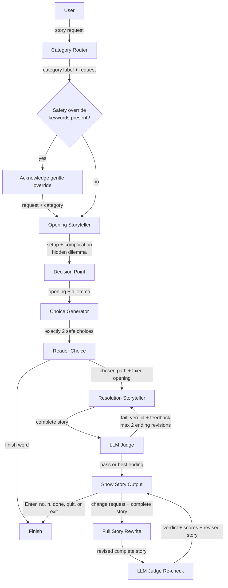

# Judge-Guided Bedtime Stories

This command-line app turns a short request into a safe, interactive five-minute
story for ages 5-10. It uses `gpt-3.5-turbo` throughout: a lightweight router
selects a style, the storyteller pauses at a dilemma, and the reader chooses one
of two paths before the ending is written. An independent judge approves the
complete story or returns concrete notes for revising only the ending. If a
request asks for a dark or scary tone that the bedtime rules will soften, the
app says so before generating.

## Architecture



The router chooses one of four prompt strategies: **adventure**, **mystery**,
**funny/silly**, or **calm bedtime**. The storyteller always enforces a
setup → complication → gentle resolution arc, retains details from the request,
and targets 400-600 words.

## Choose your own adventure

The opening contains only the setup and complication (about 200-300 words) and
ends internally with a `DECISION:` metadata line. The app removes that line
before display, uses it to generate exactly two distinct, age-appropriate paths,
and falls back to two safe local choices if the model returns malformed JSON.
The reader may pick `1` or `2`; Enter defaults to the first path, and one invalid
answer gets one friendly retry before also defaulting to the first.

The selected path and the unchanged opening are then passed to a separate ending
prompt. Judge feedback can regenerate that 200-300 word ending at most twice,
but the revision loop can never rewrite the opening the reader already saw.
This preserves the feeling that the choice mattered while keeping cost and
latency bounded.

## Run it

Python 3.10 or newer is required.

```bash
python -m venv .venv
source .venv/bin/activate
pip install -r requirements.txt
cp .env.example .env
# Open .env and paste your key after OPENAI_API_KEY=
python main.py
```

The key is read from `OPENAI_API_KEY` in your environment or a local `.env` file;
it is never printed, and `.env` is excluded from Git. If the initial prompt is
left blank, the app uses the included Alice-and-Bob example.
At startup, enter the listener's age from 5-10, or press Enter to default to 7.

At the decision point, pick `1` or `2`; Enter picks `1`. Finish words may also be
used there to stop gracefully. After the resolution appears, type a genuine
change request to rewrite and re-check the complete story. Press Enter or type
`no`, `n`, `done`, `quit`, or `exit` (in any letter case) to finish without
another model call.

## Test it

```bash
python -m unittest -v
```

## Judge rubric

The judge runs at temperature `0.1` and returns JSON with a 1-5 score for the
specific listener age on:

1. Age appropriateness
2. Complete story arc
3. Engagement
4. Fit with the routed category
5. Safety
6. Whether the resolution visibly honors the reader's choice

A draft passes only when every score is at least 4. Otherwise, the storyteller
receives the judge's specific feedback and may rewrite twice. If no version
passes, the highest-scoring draft is shown rather than spending without limit.

## Design choices

- **Routing before writing:** one short classification call buys a purpose-built
  tone and structure without burdening the user with configuration.
- **Different temperatures:** `0.8` gives the storyteller variety and `0.7`
  keeps choices creative; `0.0` routing and `0.1` judging stay predictable.
- **Bounded self-correction:** two revision rounds capture most of the benefit
  while limiting latency, cost, and the risk of an endless agent loop. Only the
  unseen ending is revised, so the interaction remains narratively consistent.
- **Validated judge output:** JSON mode plus local score validation makes the
  control flow depend on a machine-checkable rubric, not free-form praise.
- **Meaningful choice:** separate opening, choice, and resolution prompts prevent
  the model from retrofitting the dilemma after seeing the selected path.
- **Human in the loop:** a reader's change request is applied to the current
  story, then judged again before it is shown.
- **Transparent safety overrides:** a deterministic local keyword check explains
  when dark, scary, or sad requests will be softened. It adds no model call and
  does not change the judge rubric.
