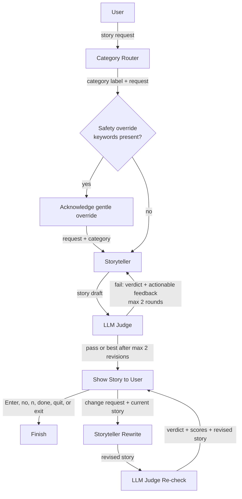

# Judge-Guided Bedtime Stories

This command-line app turns a short request into a safe, five-minute story for
ages 5-10. It uses `gpt-3.5-turbo` throughout: a lightweight router selects a
storytelling style, a storyteller writes the draft, and an independent judge
either approves it or returns concrete revision notes. The reader can then ask
for changes until the story feels right. If a request asks for a dark or scary
tone that the bedtime rules will soften, the app says so before generating.

## Architecture



The router chooses one of four prompt strategies: **adventure**, **mystery**,
**funny/silly**, or **calm bedtime**. The storyteller always enforces a
setup → complication → gentle resolution arc, retains details from the request,
and targets 400-600 words.

## Run it

Python 3.10 or newer is required.

```bash
python -m venv .venv
source .venv/bin/activate
pip install -r requirements.txt
cp .env.example .env
# Open .env and paste your key after OPENAI_API_KEY=
python main.py
```

The key is read from `OPENAI_API_KEY` in your environment or a local `.env` file;
it is never printed, and `.env` is excluded from Git. If the initial prompt is
left blank, the app uses the included Alice-and-Bob example.

After a story appears, type a genuine change request to rewrite and re-check it.
Press Enter or type `no`, `n`, `done`, `quit`, or `exit` (in any letter case) to
finish without another model call.

## Test it

```bash
python -m unittest -v
```

## Judge rubric

The judge runs at temperature `0.1` and returns JSON with a 1-5 score for:

1. Age appropriateness
2. Complete story arc
3. Engagement
4. Fit with the routed category
5. Safety

A draft passes only when every score is at least 4. Otherwise, the storyteller
receives the judge's specific feedback and may rewrite twice. If no version
passes, the highest-scoring draft is shown rather than spending without limit.

## Design choices

- **Routing before writing:** one short classification call buys a purpose-built
  tone and structure without burdening the user with configuration.
- **Different temperatures:** `0.8` gives the storyteller variety; `0.0` for
  routing and `0.1` for judging keep control decisions predictable.
- **Bounded self-correction:** two revision rounds capture most of the benefit
  while limiting latency, cost, and the risk of an endless agent loop.
- **Validated judge output:** JSON mode plus local score validation makes the
  control flow depend on a machine-checkable rubric, not free-form praise.
- **Human in the loop:** a reader's change request is applied to the current
  story, then judged again before it is shown.
- **Transparent safety overrides:** a deterministic local keyword check explains
  when dark, scary, or sad requests will be softened. It adds no model call and
  does not change the judge rubric.
